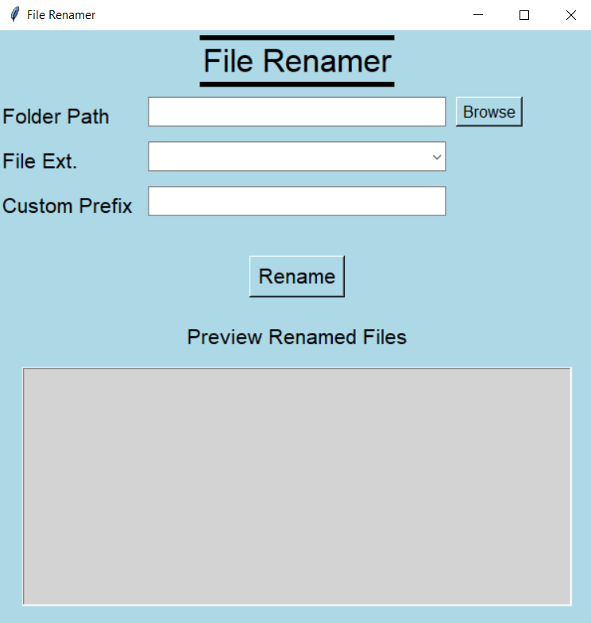

# File Renamer

**File Renamer** is a simple, GUI-based Python application built with Tkinter that lets you batch rename files in a selected folder using a custom prefix and filtered by file extension.

---

## Features

- Select a folder via file dialog.
- Automatically detects all available file extensions in the folder.
- Choose an extension from a dropdown list.
- Enter a custom filename prefix.
- Preview changes before applying them.
- Rename files with consistent, zero-padded numbering.
- Clean and centered GUI layout.
- Exportable as a standalone `.exe`.

---

## How It Works

1. Click **Browse** to select a folder.
2. Choose the file extension you want to rename (e.g., `.txt`, `.jpg`).
3. Type a prefix (e.g., `Vacation`, `Notes`, `photo_`).
4. Click **Rename** to preview the changes.
5. Confirm to apply the renaming.

---

## Screenshot

Here’s what the File Renamer looks like in action:



---

## Running the App

### Option 1: As a Python script

Ensure you have Python 3 installed.

```bash
python file_renamer.py
```

### Option 2: As a standalone `.exe`

You can download the latest `.exe` release from the [Releases](../../releases) section.

No need to install Python — just run the file.

---

## Compatibility

- ✅ Windows 10/11 (Python or `.exe`)
- ✅ Tested with `.txt`, `.png`, `.ico`, `.jpg`, `.pdf`, and more

---

## License

This project is licensed under the [MIT License](LICENSE).
